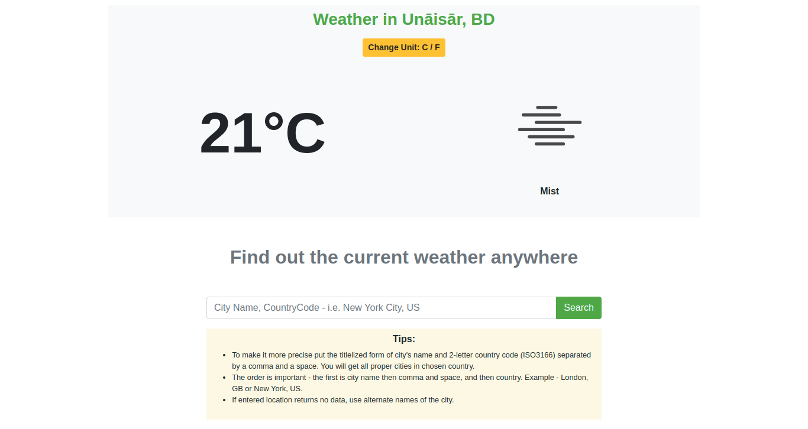

# Weather App - Weathr
In this project, I created a simple weather app using the OpenWeather API. On page load, it fetches weather data based on user's current location and displays it on the page. Users can use the search form to find the weather of city they are interested in.

It is necessary to follow the guidelines in the "Tips" section. Otherwise, you'll be notified of errors.

## Built with
- Vanilla JavaScript/ES6
- Webpack
- OpenWeather API
- HTML5 & CSS3
- Bootstrap

## Deployment
1. Open your Terminal from a folder of your choice and clone [this repo](https://github.com/anewman15/weathr/)
2. Navigate to the project directory
3. Run `npm install`
4. Then run `npm run start`
5. Open `http://localhost:8080/dist/index.html` in your browser and navigate around the site.
6. Create Projects and Todos, edit them and delete them

## Author

👤 **Abdullah Numan**

- Github:   https://github.com/anewman15
- Twitter:  https://twitter.com/aanuman15
- Linkedin: https://www.linkedin.com/in/aanuman15/
- Email:    anewman15@hotmail.com

##    Contributing

Contributions, issues and feature requests are welcome!
Please send your feedback [here](https://github.com/anewman15/weathr/issues)

## Show your support

Give a ⭐️ if you like this project!